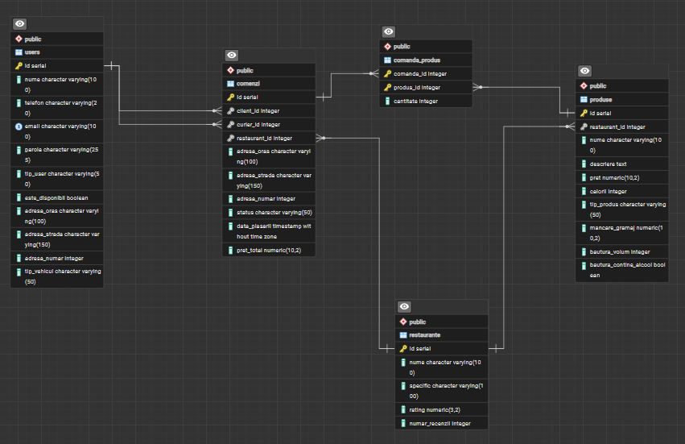

# FOOD DELIVERY APP

Proiect Java ce simuleaza o aplicatie completa de Food Delivery, cu interfata in consola (CLI) si persistenta datelor folosind o baza de date relationala (PostgreSQL). 

## Demo Video

-- de adaugat link video cu demo --

## Arhitectura Proiectului (MVC)
- **`model` (Entitati)**: Pachetul ce contine clasele de baza si structura obiectelor.
- **`repository` (Data Access Layer)**: Logica de comunicare cu baza de date prin JDBC, implementand interfata `GenericService<T>` pentru operatiile CRUD.
- **`service` (Business Logic Layer)**: Contine serviciile care imbina datele (`ActionServices`) si ofera functionalitate catre clasa `Main` (`FoodDeliveryService` actionand ca un Facade).

## Persistenta si Baze de Date
- **PostgreSQL**: Toate entitatile (User, Restaurant, Produs, Comanda) sunt salvate pe un server local PostgreSQL (db: `food_delivery_bd`). 
- **JDBC**: Conexiunea este gestionata centralizat prin clasa Singleton `DatabaseConnection`.
- **Export Fișiere CSV**: Pentru audit, toate comenzile efectuate de clienti sunt exportate automat si sub forma de text intr-un fisier csv (`comenzi.csv`) prin intermediul `CsvExportService`.

## Modele și Entități (Pachetul `model`)

1. **User (Abstract)**: `id`, `nume`, `email`, `telefon`, `parola`
    - **Admin** (extinde User)
    - **Client** (extinde User) + `adresaImplicita`, `istoricComenzi`, `cosCumparaturi`, `getTotalCos()`
    - **Curier** (extinde User) + `tipVehicul`, `esteDisponibil`
2. **Produs (Abstract)**: `id`, `nume`, `descriere`, `pret`, `calorii`, `restaurant_id`
    - **Mancare** (extinde Produs) + `gramaj`
    - **Bautura** (extinde Produs) + `volum`, `contineAlcool`
3. **Restaurant**: `id`, `nume`, `specific`, `rating`, `numarRecenzii`
4. **Comanda**: `id`, `client`, `restaurant`, `curier`, `adresa`, `produseComandate`, `status`, `dataPlasarii`, `pretTotal`
5. **Adresa**: `oras`, `strada`, `numar`

## Diagram Entitate Relatie

## Servicii și Repository
- **Interfața `GenericService<T>`**: Pentru metodele CRUD (`create`, `read`, `readOneEntity`, `update`, `delete`).
- **Repositories**: `UserService`, `RestaurantService`, `ProdusService`, `ComandaService`.
- **Services**: `AuthService`, `FoodDeliveryService`, `AdminActionService`, `ClientActionService`, `CurierActionService`, `CsvExportService`.

---

## Acțiuni Principale (Meniu CLI)

### Guest (Neautentificat):
1. Login
2. Creaza user nou (Client sau Curier)
3. Vezi toate restaurantele
4. Vezi meniul unui restaurant
0. Iesire

### Admin:
1. Adauga Restaurant nou
2. Adauga Mancare intr-un Restaurant
3. Adauga Bautura intr-un Restaurant
4. Vezi toti utilizatorii din sistem
5. Vezi lista de restaurante
6. Vezi produsele unui restaurant
0. Logout

### Client:
1. Vezi toate restaurantele (sortate dupa rating)
2. Vezi meniul unui restaurant
3. Adauga un produs in cosul de cumparaturi
4. Vizualizeaza cosul de cumparaturi
5. Plaseaza comanda (adresa implicita sau adresa custom) -> Apeleaza si exportul in `comenzi.csv`
6. Vezi istoricul comenzilor proprii
7. Vezi lista de curieri activi
8. Lasa o recenzie unui restaurant
0. Logout

### Curier:
1. Vezi comenzile disponibile (in asteptare)
2. Preia o comanda pentru livrare
3. Finalizeaza comanda (marchează ca fiind livrata)
0. Logout
